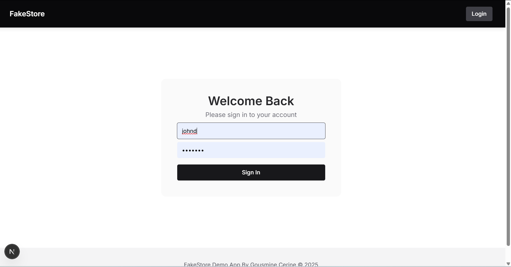

# FakeStore Admin Dashboard

  
(./public/product.png)  
(./public/product_page.png)  

*A modern e-commerce dashboard built with Next.js*


###  Completed Requirements
- **User Authentication**  
  - Login/logout flow
  - Protected routes
  - Admin privileges system : -  username: johnd
                              -  password: m38rmF$

- **Product Management (CRUD)**
  - Create/edit products with image uploads
  - Responsive product listings
  - Delete functionality

- **Enhanced UX**
  - Real-time search & category filtering
  - Pagination with "Load More"
  - Optimized image loading
  - Loading/error states

- **Technical Highlights**
  - Next.js App Router
  - Zustand state management
  - Chakra UI component library
  - Client-side caching

## 📦 Project Structure
fakestore-project/
├─ .next/
├─ public/
├─ src/
│  ├─ app/
│  │  ├─ login/
│  │  │  └─ page.js
│  │  ├─ products/
│  │  │  ├─ [id]/
│  │  │  │  ├─ edit/
│  │  │  │  │  └─ page.js
│  │  │  │  └─ page.js
│  │  │  ├─ new/
│  │  │  │  └─ page.js
│  │  │  └─ page.js
│  │  ├─ error.js
│  │  ├─ favicon.ico
│  │  ├─ globals.css
│  │  ├─ layout.js
│  │  ├─ not-found.js
│  │  ├─ page.js
│  │  ├─ page.module.css
│  │  └─ providers.js
│  ├─ components/
│  │  ├─ auth/
│  │  ├─ layout/
│  │  │  └─ MainLayout.js
│  │  ├─ products/
│  │  │  ├─ OptimizedImage.js
│  │  │  ├─ ProductCard.js
│  │  │  ├─ ProductFilter.js
│  │  │  ├─ ProductForm.js
│  │  │  └─ ProductSearch.js
│  │  └─ ui/
│  │     ├─ color-mode.jsx
│  │     ├─ ErrorBoundary.js
│  │     ├─ provider.jsx
│  │     ├─ toaster.jsx
│  │     └─ tooltip.jsx
│  ├─ lib/
│  │  ├─ api/
│  │  │  └─ fakestore.js
│  │  ├─ hooks/
│  │  │  └─ useApiCache.js
│  │  └─ utils/
│  └─ store/
│     ├─ authStore.js
│     └─ productStore.js
├─ .gitignore
├─ jsconfig.json
├─ middleware.js
├─ next.config.mjs
├─ package-lock.json
├─ package.json
├─ postcss.config.js
├─ README.md
└─ tailwind.config.js
## 🛠️ Development Setup

1. **Clone the repository**
   ```bash
   git clone https://github.com/your-username/fakestore.git
   cd fakestore
1. **Install dependencies** :
    npm install
2. **Run the development server**:
      npm run dev
3. **Access the app**:
     http://localhost:3000

###  Authentication

   - Any username/password works 

    - Admin access: -  username: johnd
                    -  password: m38rmF$
  

### Key Technical Decisions :

  | Feature         | Implementation                   | Technical Benefit |
|----------------   |--------------------------------  |-------------------|
| State Management  | Zustand                          | 50% less code than Redux |
| Routing           | Next.js App Router	           | Modern features, RSC support |
| UI Library        | Chakra UI                        | Accessibility, theming|
|Performance        |Next.js Image, Client-side cache  | Fast loading, reduced API calls|
| Auth              | Cookie-based session             | Simple implementation|